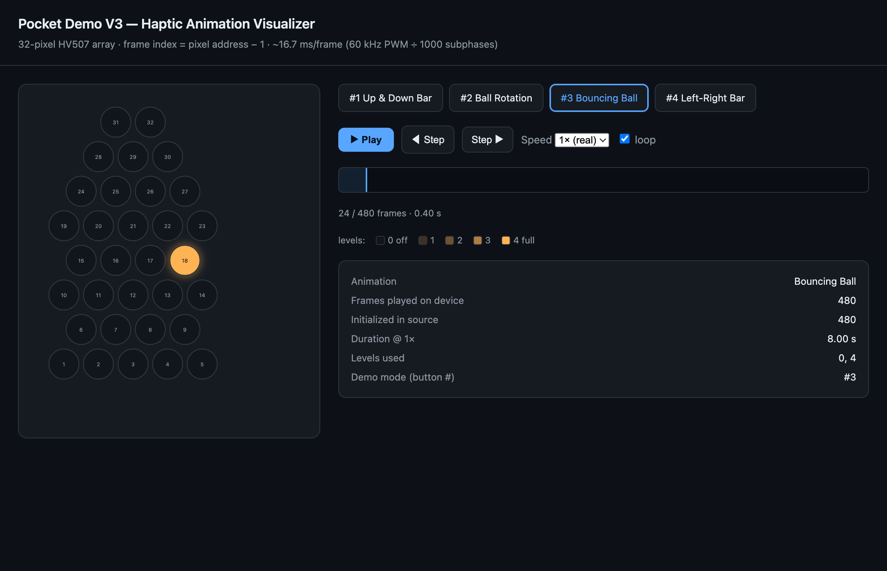

# Pocket Demos

Arduino/PlatformIO firmware for **Pocket Demo V3** — a pocket-sized **pneumatic haptic
display**. A Teensy 4.0 drives 32 air-cell "pixels" through a single 64-output HV507
high-voltage shift register, playing pre-recorded inflation animations. A button cycles
through the demos; each is bracketed by a short deflate.

## Animations

The button on pin 7 cycles `demoMode` 1 → 4 → 1:

| # | Animation       | Notes                                                        |
|---|-----------------|--------------------------------------------------------------|
| 1 | Up & Down Bar   | A bar sweeping vertically                                    |
| 2 | Ball Rotation   | A blob orbiting the array                                    |
| 3 | Bouncing Ball   | A single pixel bouncing off the diamond's edges (~8 s)       |
| 4 | Left-Right Bar  | A bar sweeping horizontally                                  |

Each pixel is a level **0–4** (0 = off/deflated, 4 = full pressure); the demos use 0 and 4.

## Visualizer

[`animation_visualizer.html`](animation_visualizer.html) is a standalone, self-contained web
page (no server, no dependencies) that animates every demo on the real diamond pixel layout.
**Just open the file in a browser.**



Features: per-demo tabs, real-time playback at the device's true ~16.7 ms/frame, speed control
(0.25×–4×), single-step, a scrubbable timeline, and per-demo metadata (frame count, duration,
levels used). It embeds its own JSON copy of the frame data, so it stays truthful to what the
firmware plays.

## Creating new animations with Claude Code

The animations are just `demoFramesN[NUM_FRAMES_N][32]` arrays — each frame is 32 brightness
levels (0–4), where **array index `i` maps to physical pixel address `i + 1`** (see
[`Homer_haptic_output_pixel_numbering.png`](Homer_haptic_output_pixel_numbering.png) for the
layout). Hand-authoring hundreds of frames is painful, so this repo is set up to generate them
with [Claude Code](https://claude.com/claude-code).

A typical session:

1. **Describe the animation.** e.g. *"Add a snake that crawls a random path around the
   display"* or *"Make a ripple that expands from the center."* Claude generates the frame data
   programmatically (a path + motion model) rather than by hand.
2. **Preview it in the visualizer.** Ask Claude to *"add it to the visualizer"* — it injects the
   new frames as a tab in `animation_visualizer.html` so you can watch it before touching the
   hardware. Iterate here: *"slow it down 25%,"* *"keep it to level 4 only,"* *"make the path
   less regular."*
3. **Promote it to the firmware.** When you're happy, ask Claude to *"add it as demo #N"* (or
   *"put it where X was"*). It inserts the `demoFramesN` array, wires up the playback branch and
   button cycle, and renumbers cleanly.
4. **Flash it.** *"Flash it"* runs `pio run -t upload`. Claude verifies the build first.

Tips for good prompts:
- Say where it goes in the rotation (*"as the first one"*, *"replace raindrops"*).
- Constrain brightness if you want crisp motion (*"level 4 only"*, no partial-pressure tail).
- Ask for a specific feel (*"~6 seconds"*, *"bounce off the edges"*, *"loop seamlessly"*).

> The visualizer's frame data is a **copy** — promoting an animation to the firmware and adding
> it to the visualizer are two separate steps. Claude keeps them in sync when asked; if you edit
> `demoFramesN[][]` by hand, update the visualizer's `DEMOS` blob too.

## Build / flash / monitor

Targets the **Teensy 4.0** via PlatformIO. The sketch lives in its Arduino-IDE folder
(`Pocket_Demo_V3/`) so it also opens in the Arduino IDE; `platformio.ini` points `src_dir`
there.

```
pio run                       # build
pio run -t upload             # build + flash (teensy-cli loader, no GUI app needed)
pio device monitor -b 250000  # serial monitor (see baud note below)
```

> **Baud note:** the sketch calls `Serial.begin(250000)` while `platformio.ini` sets
> `monitor_speed = 115200`. Monitor at **250000** to read output correctly.

If the upload hangs at *"Waiting for Teensy device…"*, tap the physical reset button on the
Teensy to force it into the bootloader.

## Serial control

`SET 0 <pixel> <level> [<pixel> <level> …]` sets manual pixel levels and disables the running
demo. Address is always `0`, pixel `0–31`, level `0–4`.

## Pin configuration

| Function          | Pin |
|-------------------|-----|
| SPI MOSI          | 11  |
| SPI Clock         | 13  |
| SPI Latch Enable  | 6   |
| Blank             | 9   |
| Shift Enable      | 4   |
| HV Enable         | 5   |
| HV Control        | 23  |
| Button            | 7   |

## Repository layout

- [`Pocket_Demo_V3/Pocket_Demo_V3.ino`](Pocket_Demo_V3/Pocket_Demo_V3.ino) — the firmware (logic
  + inline frame data).
- [`animation_visualizer.html`](animation_visualizer.html) — browser-based animation previewer.
- `*_frame_data_*.h` — a library of exported animation arrays (not compiled in; copied into the
  sketch one at a time).
- [`CLAUDE.md`](CLAUDE.md) — architecture notes for working in this repo with Claude Code.
